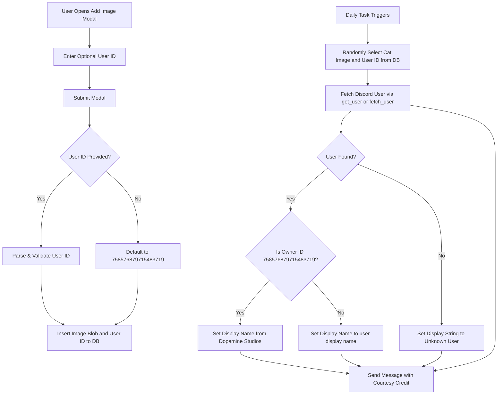

# Plan: Add User ID and Courtesy Attribution to Daily Cat Images

## Overview
This plan outlines the steps to associate a Discord user ID with each cat image stored in the database (`cat_images`), allow users to provide an optional user ID when adding images via the upload modal or `catadd` command, and display a courtesy credit (`-# Courtesy: {the_string}`) when posting daily cat pictures.

---

## Technical Specifications & Changes

### 1. Database Schema (`utils/database.py`)
- Update the `cat_images` table creation definition to include a `user_id` INTEGER column (defaulting to `758576879715483719`).
- Ensure existing databases without `user_id` can be migrated safely via an `ALTER TABLE cat_images ADD COLUMN user_id INTEGER DEFAULT 758576879715483719` check during database initialization.

### 2. Upload Modal & Command (`cogs/daily.py`)
- **`AddImageModal`**:
  - Add an optional `discord.ui.TextInput` field for `Uploader User ID` (optional, placeholder: "Discord User ID (defaults to owner)").
  - In `on_submit`, parse the provided user ID string. If blank or invalid integer, fallback to `758576879715483719`.
  - Insert `image_data` and `user_id` into `cat_images`.
- **`catadd` Command**:
  - Optionally accept an integer `user_id` argument (defaults to author's ID or `758576879715483719`).

### 3. User Resolution & Formatting Logic
- When retrieving a cat image (e.g., in `daily_task`):
  - Select both `image_data` and `user_id` from `cat_images`.
  - Resolve user object:
    ```python
    user = self.bot.get_user(user_id)
    if user is None:
        try:
            user = await self.bot.fetch_user(user_id)
        except Exception:
            user = None
    ```
  - Determine display string:
    - If `user_id == 758576879715483719` (or `user` name with owner branding):
      `display_name = user.display_name if user else "Unknown User"`
      `the_string = f"{display_name} from Dopamine Studios"`
    - Else if `user` is found:
      `the_string = user.display_name`
    - Else:
      `the_string = "Unknown User"`
  - Format message content:
    ```python
    courtesy_line = f"Courtesy: {the_string}"
    content = f"Today's Cat Pic ({courtesy_line})"
    ```

---

## Architecture Flow (Mermaid Diagram)


