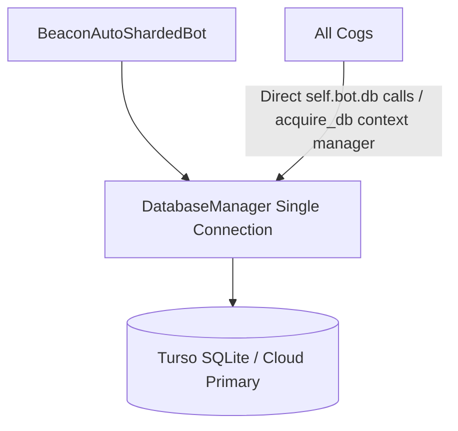

# Plan: Complete Database Centralization

## Architectural Philosophy
Following the migration to Turso, the core philosophy is a **single connection, single database (`databases/dopamine.db`) shared across the ENTIRE bot**. Cogs should not maintain individual connection pools or redundant wrapper methods (`db_pool`, local `acquire_db()`), but should query directly against `self.bot.db`.

---

## Architecture Diagram

---

## Action Items

1. **Refactor Cogs to Eliminate Redundant DB Pools & Proxies**
   - Remove `db_pool` and local `acquire_db()` definitions from cogs where they merely proxy to `self.bot.db`.
   - Update all queries to utilize `self.bot.db` directly.

2. **Validate Single Connection Integrity**
   - Ensure thread-safe, lock-protected access through [`utils/database.py`](utils/database.py:74).
